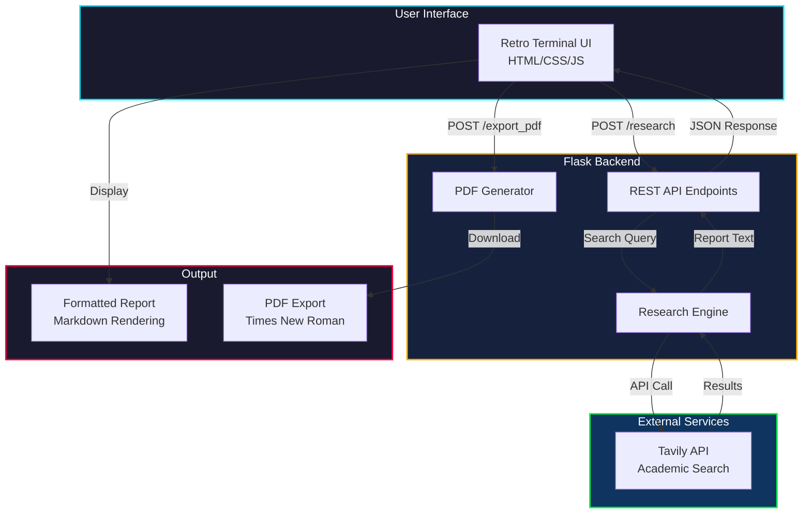
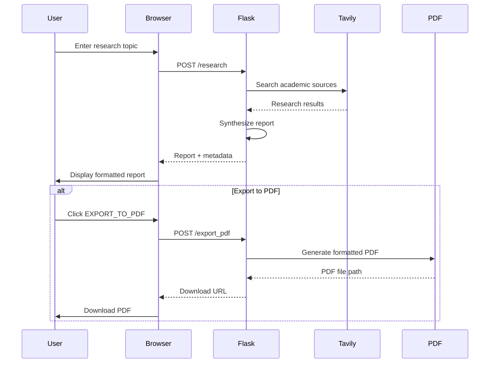

# ArXiv Research Assistant

**A retro-futuristic AI-powered research synthesis platform.**

ArXiv Research Assistant is a sophisticated web application that combines the power of AI with a unique retro terminal aesthetic. It searches academic sources, synthesizes research findings, and presents them in a beautifully formatted interface reminiscent of 1980s sci-fi computer terminals.



## Features

### Research Capabilities
- **AI-Powered Search:** Leverages Tavily API to search academic databases and research papers
- **Intelligent Synthesis:** Automatically synthesizes findings into comprehensive markdown reports
- **Multi-Source Analysis:** Aggregates information from multiple academic sources
- **Executive Summaries:** Generates concise summaries alongside detailed findings

### Retro-Futuristic Interface
- **CRT Monitor Effect:** Authentic scanlines, screen flicker, and phosphor glow
- **Terminal Aesthetic:** Amber/cyan phosphor colors on dark background
- **Animated Elements:** Boot sequences, typing effects, progress indicators
- **Responsive Design:** Works on desktop and mobile devices

### Report Features
- **In-Browser Display:** View full research reports with markdown formatting
- **PDF Export:** Generate professionally formatted PDFs on-demand
- **Times New Roman Font:** Clean, academic typography in exported PDFs
- **Markdown Rendering:** Proper headings, lists, bold, and italic formatting

## Architecture

The application follows a clean client-server architecture:



### Technology Stack

- **Frontend:** HTML5, CSS3, Vanilla JavaScript
- **Backend:** Python, Flask
- **AI/Search:** Tavily API
- **PDF Generation:** FPDF with custom markdown parser
- **Styling:** Custom CSS with CSS variables for theming

## Getting Started

### Prerequisites
- Python 3.8+
- Tavily API key

### Installation

1. **Clone the repository:**
```bash
git clone https://github.com/sarankumar1325/Arixiv-Research-Assistant-.git
cd Arixiv-Research-Assistant-
```

2. **Create virtual environment:**
```bash
python -m venv venv
source venv/bin/activate  # On Windows: venv\Scripts\activate
```

3. **Install dependencies:**
```bash
pip install flask fpdf tavily-python python-dotenv flask-cors
```

4. **Set up environment variables:**
Create a `.env` file:
```env
TAVILY_API_KEY=your_tavily_api_key_here
```

5. **Run the application:**
```bash
python app.py
```

6. **Access the interface:**
Open your browser and navigate to `http://localhost:5000`

## Usage Guide

### Performing Research

1. **Enter Topic:** Type your research topic in the terminal input
2. **Execute:** Click `[ EXECUTE_RESEARCH ]` or press Enter
3. **Wait:** Watch the boot sequence and progress indicators
4. **Review:** Read the synthesized report in the terminal interface
5. **Export:** Click `[ EXPORT_TO_PDF ]` to download a formatted PDF

### Interface Elements

- **Terminal Window:** Main interface container with CRT effects
- **Command Line:** Input field with retro prompt (`user@chimera:~$`)
- **Progress Steps:** Visual indicators for Search → Analyze → Synthesize → Generate
- **Report Display:** Scrollable markdown-formatted research output
- **Status Messages:** Success/error notifications in terminal style

## Design Philosophy

The interface draws inspiration from:
- 1980s sci-fi movie terminals (Blade Runner, Alien)
- Classic CRT monitor aesthetics
- Cyberpunk color palettes
- Command-line interfaces

Key design elements:
- **Phosphor Glow:** Amber (#ffb000) and cyan (#00f0ff) accents
- **Scanlines:** Authentic CRT screen effect
- **Monospace Typography:** VT323 and Space Mono fonts
- **Terminal Patterns:** Grid backgrounds, corner brackets, status indicators

## Development

### Project Structure
```
Arixiv-Research-Assistant-
├── app.py                 # Flask application
├── research.py            # Research engine and PDF generator
├── templates/
│   └── index.html        # Terminal UI
├── static/
│   └── style.css         # Retro terminal styling
├── papers/               # Generated PDF storage
└── README.md
```

### Customization

**Colors:** Edit CSS variables in `static/style.css`:
```css
:root {
  --phosphor-primary: #ffb000;    /* Amber */
  --accent-cyan: #00f0ff;         /* Cyan */
  --terminal-bg: #0a0a0f;         /* Dark background */
}
```

**Fonts:** Modify font imports in `templates/index.html`:
```html
<link href="https://fonts.googleapis.com/css2?family=Your+Font&display=swap" rel="stylesheet">
```

## Deployment

### Free Hosting Options

1. **Render** (Recommended)
   - Connect GitHub repository
   - Auto-deploy on push
   - Free tier with 512MB RAM

2. **Railway**
   - $5/month free credit
   - One-click deploy
   - Generous resources

3. **PythonAnywhere**
   - Always-on free tier
   - Manual deployment
   - Good for small projects

### Environment Variables for Production

Ensure these are set in your hosting platform:
- `TAVILY_API_KEY` - Required for research functionality
- `FLASK_ENV` - Set to `production` for production deployments

## Contributing

Contributions are welcome! Areas for improvement:
- Additional academic data sources
- Enhanced markdown parsing
- More export formats (DOCX, HTML)
- Dark/light theme toggle
- Keyboard shortcuts

## License

This project is open source and available under the MIT License.

## Acknowledgments

- **Tavily** for providing the academic search API
- **FPDF** for PDF generation capabilities
- **Google Fonts** for VT323 and Space Mono typography
- **The retro computing community** for aesthetic inspiration

---

**Built with passion for retro-futuristic interfaces.**

*"The future is already here — it's just not evenly distributed."* — William Gibson
